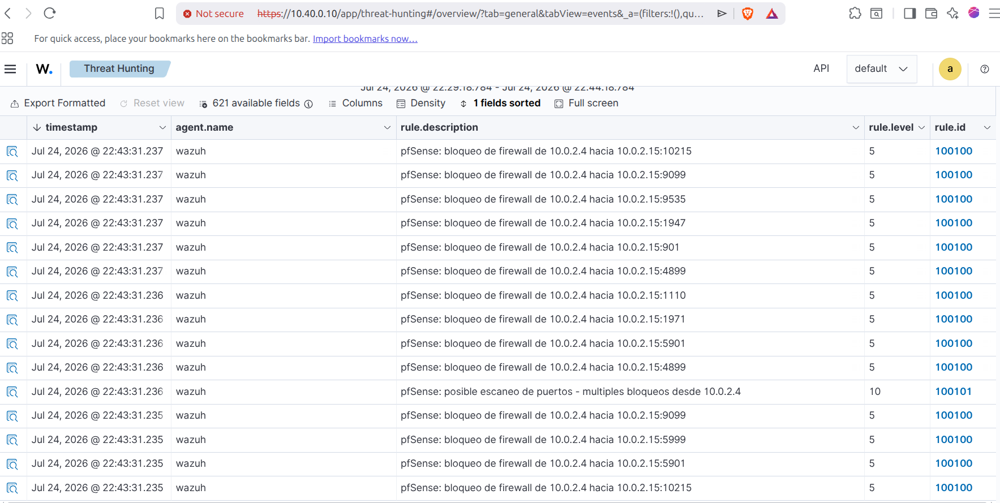
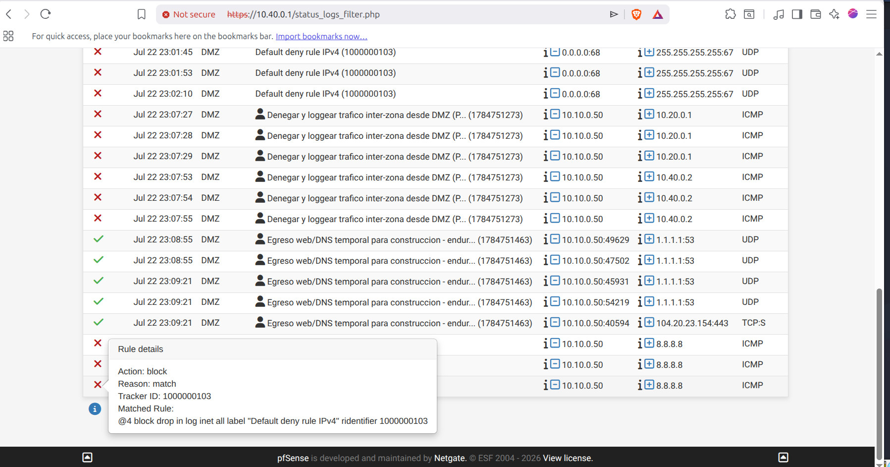

# Lab SOC Bancario

Monté el SOC de un banco en miniatura para practicar del lado defensivo: segmentar la red como pide PCI, mandar todo a un SIEM y escribir yo las detecciones en vez de bajar reglas hechas. Corre entero en VirtualBox sobre un host de 30 GB de RAM — cuatro zonas internas, un firewall, un SIEM y un dominio Windows, más una Kali afuera haciendo de atacante.

Es un lab de estudio, en construcción. No es una arquitectura de producción ni pretende serlo: es el banco de pruebas donde rompo cosas para después detectarlas.

## Una detección, de punta a punta

Antes que la teoría, lo que hace. Kali escanea el firewall desde afuera:

```bash
sudo nmap -Pn -sS 10.0.2.15     # la cara WAN de pfSense, desde la "internet" del lab
```

pfSense bloquea cada puerto y lo registra. Ese log viaja por syslog al Wazuh, un decoder que escribí lo parsea, y dos reglas propias lo levantan: una por cada bloqueo y otra que reconoce el patrón y lo nombra.



*Las reglas `100100` (bloqueo, nivel 5) y `100101` ("posible escaneo de puertos", nivel 10) disparando tras el nmap. El `srcip` 10.0.2.4 es la Kali.*

El escaneo entra por un lado y sale como una alerta con nombre y severidad por el otro. Ese circuito —evento, decoder, regla, alerta— es de lo que trata el lab.

## Arquitectura

Cuatro zonas internas más la WAN. El segundo octeto es el número de VLAN, y pfSense es el `.1` de cada red:

```
"Internet" simulada (lab-wan, NAT)   10.0.2.0/24    Kali — atacante externo (.4)
        |
   [ pfSense ]   fw-banco.banco.lab
        |
        +-- DMZ    10.10.0.0/24   banca en línea (portal + WAF)     [pendiente]
        +-- CDE    10.20.0.0/24   datos de tarjeta / PCI            [pendiente]
        +-- CORP   10.30.0.0/24   Active Directory + estaciones     DC01 .10 · estación .50
        +-- SOC    10.40.0.0/24   gestión y monitoreo               Wazuh .10 · analista .2
```

Cada zona es un dominio de confianza distinto. El CDE no habla con nadie salvo lo explícitamente permitido, el SOC ve todo pero nadie entra al SOC, y el atacante vive del lado WAN: sus escaneos tienen que cruzar el firewall para dejar rastro. La segmentación no es decorativa, es el control de PCI DSS Req. 1, y está probada (más abajo), no solo dibujada.

## Stack

| Componente | Versión | Rol | Dónde |
|---|---|---|---|
| pfSense | 2.8.1 | Firewall y gateway de cada zona | `.1` de cada red |
| Wazuh | 4.14 | SIEM/EDR (Manager, Indexer, Dashboard) | SOC · 10.40.0.10 |
| Windows Server | 2022 | Domain Controller, bosque `banco.lab` | CORP · 10.30.0.10 |
| Windows 10 Pro | — | Estación de empleado, unida al dominio | CORP · 10.30.0.50 |
| Kali Linux | 2026.2 | Atacante externo | WAN · 10.0.2.4 |
| VirtualBox | — | Hipervisor (host de 30 GB) | — |

El Wazuh corre sobre Ubuntu Server 26.04. Le di 8 GB de RAM porque el Indexer (OpenSearch) es de Java y con menos se ahoga.

## Detección

| Regla | Qué caza | MITRE ATT&CK | Nivel | Marco |
|---|---|---|---|---|
| `100100` | Cada bloqueo del firewall (origen → destino:puerto) | — | 5 | PCI DSS 1.4 |
| `100101` | 15+ bloqueos del mismo origen en 60 s (escaneo) | T1595 · Active Scanning | 10 | PCI DSS 11.4 |

Las dos cuelgan de un decoder propio, `pfsense-fw`. Decoder y reglas están en [`wazuh/`](wazuh/).

Por qué un decoder propio y no el de Wazuh: pfSense manda el `filterlog` por syslog **sin el campo hostname** (comportamiento conocido de FreeBSD). El decoder oficial engancha por `program_name`, que sin hostname queda vacío, así que nunca arrancaba. Lo normalicé del lado del SIEM —que es lo que hace un SOC cuando no controla el equipo de origen— enganchando por el patrón del log en vez de por el hostname. El detalle está en [`docs/02-siem-wazuh.md`](docs/02-siem-wazuh.md).

## Cómo validé la segmentación

"Configurado" no es "funciona". Planté una VM temporal en la DMZ como servidor comprometido y corrí una prueba de cinco caras: lo prohibido (ping a otra zona, bloqueado y loggeado por mi regla), lo permitido (DNS y HTTPS de salida, pasan) y lo no contemplado (ping a internet, muere en el default-deny). Cada resultado con doble evidencia: la terminal del atacante y el log del firewall.



*El firewall bloqueando tráfico inter-zona, con la descripción de mi regla y el tracker ID en el log.*

## Estado

**Fase 1 — Segmentación y firewall: cerrada.** Cuatro zonas más la WAN, reglas de bloqueo inter-zona verificadas en el motor `pf` (no solo en la GUI), egreso controlado.

**Fase 2 — SIEM y Active Directory: en curso.** Wazuh desplegado, ingesta de pfSense por syslog, decoder y reglas de detección funcionando de punta a punta. Dominio `banco.lab` montado y estaciones uniéndose.

Lo que sigue: agente Wazuh y Sysmon en los Windows (telemetría de endpoint), FIM sobre el CDE, y una mini-fase en AWS (IAM/MFA, EC2, CloudTrail hacia Wazuh) para cubrir la parte cloud.

## Un problema que valió la pena

El más largo de resolver fue el del hostname. El transporte funcionaba —un `tcpdump` mostraba los paquetes syslog llegando al puerto 514—, pero en el dashboard no aparecía ninguna alerta. Llegar no es lo mismo que procesarse. Lo desarmé con `wazuh-logtest`, que muestra las tres fases por las que pasa un log (pre-decoding, decoding, reglas), y ahí quedó a la vista: Wazuh tomaba `filterlog[pid]:` como hostname y dejaba el programa vacío. De ahí salió el decoder propio. Está contado entero en [`docs/02-siem-wazuh.md`](docs/02-siem-wazuh.md).

## Aviso

Este lab es inseguro a propósito: contraseñas débiles, servicios expuestos entre zonas para poder probar detecciones. Vive aislado en redes internas de VirtualBox y no toca ninguna red real. No reutilices estas configuraciones en producción.

## Mapa del repo

- [`docs/`](docs/) — el detalle técnico por fase: firewall, SIEM, mapa de red.
- [`wazuh/`](wazuh/) — decoders y reglas de detección propias.
- [`evidence/`](evidence/) — capturas de cada paso con resultado visible.
- [`automation/`](automation/) — scripts de la fase SOAR (en preparación).
