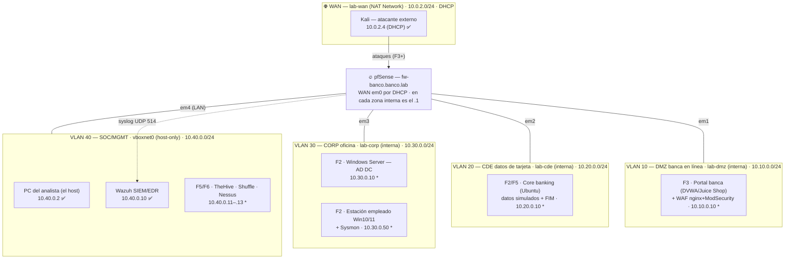

# Mapa de red — Banco Demo S.A.

Referencia de direccionamiento del laboratorio por zona: red asignada, IP de cada host (actual y
planificado) y política de firewall que la gobierna.

## topología

Leyenda: **✅ vivo hoy** · **F*n*** = llega en esa fase · **\*** = IP *sugerida por convención*, aún
sin asignar (confirmarla aquí cuando el host exista).

## tabla maestra por zona

| Zona (rol bancario) | Red / CIDR | pfSense | Red VirtualBox (tipo) | Hosts HOY | Hosts planificados (fase) |
|---|---|---|---|---|---|
| **WAN** — "internet" simulada | `10.0.2.0/24` (DHCP) | `em0` · IP por DHCP | `lab-wan` (**NAT Network**) | Kali `10.0.2.4` ✅ | — |
| **DMZ** (VLAN 10) — banca en línea | `10.10.0.0/24` | `em1` · `10.10.0.1` | `lab-dmz` (interna) | *(vacía)* | Portal banca + WAF `10.10.0.10`\* (F3) |
| **CDE** (VLAN 20) — datos de tarjeta (PCI) | `10.20.0.0/24` | `em2` · `10.20.0.1` | `lab-cde` (interna) | *(vacía)* | Core banking Ubuntu + FIM `10.20.0.10`\* (F2/F5) |
| **CORP** (VLAN 30) — oficina + AD | `10.30.0.0/24` | `em3` · `10.30.0.1` | `lab-corp` (interna) | *(vacía)* | DC Windows Server `10.30.0.10`\* · estación empleado `10.30.0.50`\* (F2) |
| **SOC/MGMT** (VLAN 40) — gestión y monitoreo | `10.40.0.0/24` | `em4` (LAN) · `10.40.0.1` | `vboxnet0` (**host-only**) | PC analista `10.40.0.2` ✅ · Wazuh `10.40.0.10` ✅ | TheHive/Shuffle/Nessus `10.40.0.11–.13`\* (F5/F6) |

## mapa NIC ↔ em ↔ zona

Verificado por MAC el 21/07. El orden de las interfaces no es fiable a ciegas; esta tabla es la que manda.

| NIC VBox | MAC | em | Zona |
|---|---|---|---|
| 1 | `08:00:27:EC:1F:D1` | em0 | WAN |
| 2 | `08:00:27:2A:CE:BE` | em1 | DMZ |
| 3 | `08:00:27:46:AC:4C` | em2 | CDE |
| 4 | `08:00:27:9E:B2:F3` | em3 | CORP |
| 5 | `08:00:27:27:1B:1C` | em4 | SOC (LAN) |

## convenciones de direccionamiento

1. **Segundo octeto = número de VLAN del diseño:** 10=DMZ · 20=CDE · 30=CORP · 40=SOC.
2. **`.1` = pfSense**, gateway de cada zona interna.
3. **`.2` = estación del analista** (solo existe en SOC: es la PC física vía vboxnet0).
4. **`.10`+ = servidores** (Wazuh `10.40.0.10` ya lo fija; core banking y DC siguen la pauta).
5. **`.50`+ = estaciones / hosts de prueba** (Kali usó `10.10.0.50` cuando se plantó temporal en la DMZ).
6. **Zonas internas SIN DHCP, todo IP estática** (a propósito: hasta el broadcast DHCP de un intruso
   muere en el default deny y queda loggeado). La única red con DHCP es la WAN (`lab-wan`).

## política de firewall vigente (Fase 1, verificada en el motor pf)

Aliases: **`LAB_NETS`** = las 4 redes internas · **`EGRESO_WEB`** = puertos 53/80/443.

| Zona | Puede iniciar | Bloqueado + LOG | Nota |
|---|---|---|---|
| DMZ / CDE / CORP | Egreso TCP/UDP a `EGRESO_WEB` (53/80/443) hacia fuera — regla **temporal de construcción**, con log | **Todo tráfico hacia `LAB_NETS`** (inter-zona, PCI Req. 1) — regla 1, primera | El orden ES la política: el block atrapa antes del pass. Lo demás muere en el **deny implícito** (p. ej. ICMP a internet) |
| SOC (LAN) | Todo (defaults: allow-all + anti-lockout) | — | Zona de confianza del analista; **nadie entra al SOC desde otra zona** (cae en el block de la zona origen) |
| WAN | — (sin reglas propias) | Todo lo entrante muere en el **default deny**, que loggea | RFC1918/bogons **desmarcados a propósito**: el "internet" del lab es red privada y los ataques de Kali deben llegar a generar alertas |

Pendiente declarado: **endurecer el egreso** de las zonas internas al final de la construcción
(hoy es 53/80/443 abierto a cualquier destino externo).
